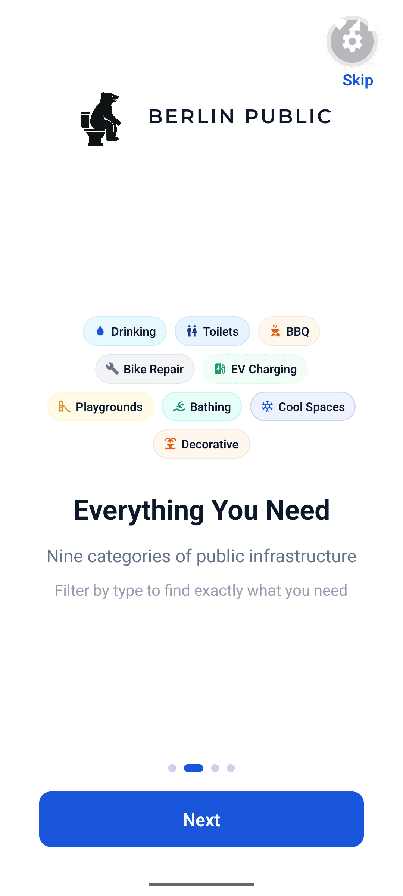
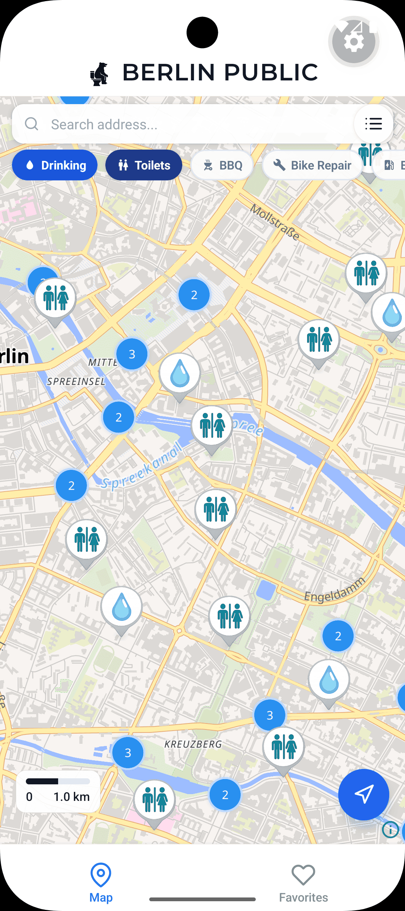
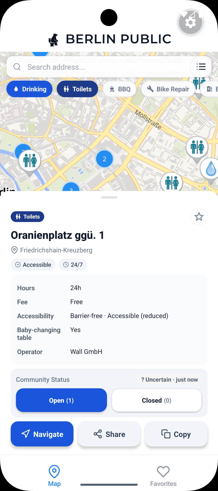
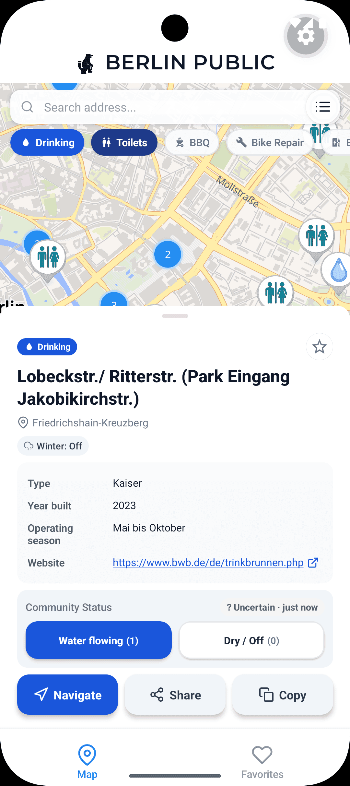

<div align="center">


# Berlin Public

**Find public fountains, toilets & essential amenities across Berlin.**

Offline-first · community-verified · free & open-source.

<a href="https://play.google.com/store/apps/details?id=com.blobstudio.berlinpublic">
  
</a>

<br/>


</div>

---

## Screenshots

<div align="center">
  
  &nbsp;
  
  &nbsp;
  
  &nbsp;
  
</div>

## Features

Nine categories of public infrastructure, all on one map:

| | | |
|---|---|---|
| 🚰 Drinking fountains | 🚻 Public toilets | 🔥 BBQ spots |
| 🔧 Bike repair stations | ⚡ EV charging | 🛝 Playgrounds |
| 🏊 Bathing spots | ❄️ Cool spaces | ⛲ Decorative fountains |

Plus everything you need to actually use them:

- 📍 **Offline browsing** — amenity data is cached after the first sync; the map keeps working with no signal
- 🔎 **Filter & search** — toggle categories and search by address
- 📋 **Rich details** — hours, fees, accessibility, baby-changing, operator, season, official links
- 👍 **Community status** — vote a toilet open/closed or a fountain flowing/dry, and see how fresh the info is
- ⭐ **Favorites** — save your go-to spots for quick access
- 🧭 **One-tap navigation** — hands off to Citymapper, Google Maps, Apple Maps, or the web

## Tech Stack

- **React Native** with **Expo SDK 55** (New Architecture / Fabric)
- **MapLibre Native** + **[OpenFreeMap](https://openfreemap.org/)** vector tiles — free, keyless, OpenStreetMap-based
- **React Navigation** v7 (native-stack + bottom-tabs, static config)
- **TypeScript** (strict)
- **Supabase** for community status reports
- Offline-first caching with **AsyncStorage**

## Data Sources

- **Amenity data** — [Berlin Open Data](https://daten.berlin.de/) WFS feeds (`gdi.berlin.de`): drinking fountains, ornamental fountains, public toilets
- **Map tiles** — [OpenFreeMap](https://openfreemap.org/), rendered from [OpenStreetMap](https://www.openstreetmap.org/copyright) data
- **Community status** — crowd-sourced reports from app users

## Getting Started

> Requires a **development build** — this app uses the MapLibre native module and can't run in Expo Go.

1. Install dependencies:
   ```sh
   npm install
   ```

2. Set up environment variables:
   ```sh
   cp .env.example .env
   ```
   Maps need **no key** (MapLibre + OpenFreeMap). Supabase credentials are optional —
   without them, community features fall back to local storage. See
   [`.env.example`](.env.example) for what each variable does.

3. Start the dev server:
   ```sh
   npm start
   ```

4. Build and run on a device or emulator:
   ```sh
   npm run android
   # or
   npm run ios
   ```

`app.config.ts` is the source of truth for native config — `android/` and `ios/`
are generated. Regenerate them with `npm run prebuild` instead of editing by hand.

## Contributing

Contributions are welcome! Please read [CONTRIBUTING.md](CONTRIBUTING.md) for
setup, conventions, and the pull-request process. By participating you agree to
our [Code of Conduct](CODE_OF_CONDUCT.md).

Quick checks before opening a PR:
```sh
tsc --noEmit   # type check
npm test       # unit tests
```

## License

[MIT](LICENSE) © Iustin Nita

## Contact

- **Email:** contact@blobstudio.dev
- **Privacy Policy:** https://iustin-nita.github.io/berlin-privacy-policy/PRIVACY_POLICY.md
